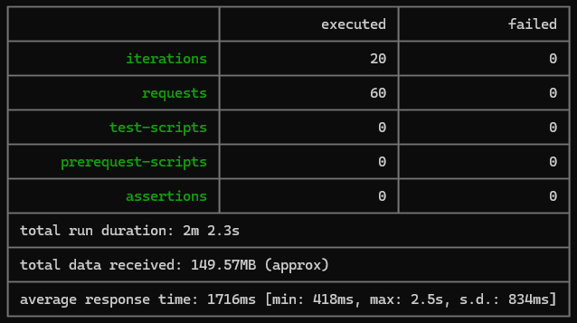
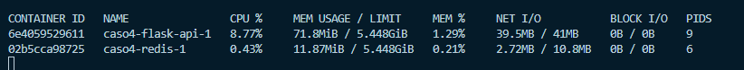

# Caso 4 - conexiones de datos y concurrencia en REST

## Descripción
Este proyecto consiste en una API RESTful creada con Flask que se conecta a MongoDB Atlas para manejar 60,000 registros ficticios. También se implementa Redis como caché para mejorar el rendimiento de las consultas. Se harán pruebas usand Postman y Newman para ejecutar 20 hilos de clientes concurrentes, enviando peticiones cada 233ms a los tres endpoints manejados en el API: /productos/limit, productos/cached y productos/pool.

## Documentación

### 1. Uso de CPU:
1. Flask API: El uso de CPU varía, con picos alrededor del 17.06%, y bajadas de hasta 0.22%. Se observa que durante los momentos de mayor carga, el uso de CPU sube significativamente, lo que indica que el procesamiento de solicitudes puede estar demandando recursos a medida que más clientes acceden al sistema. Además, se aprecia que el uso de CPU es mayor en las primeras 5 iteraciones apróx y a partir de cierto punto el máximo de CPU se mantiene en 14.38%.
2. Redis: El uso de CPU es bastante bajo en comparación con la API, permaneciendo consistentemente entre 0.33% y 0.66%, lo que sugiere que el uso de Redis para almacenamiento en caché no está sobrecargando el sistema.

### 2. Uso de Memoria:
1. Flask API: El uso de memoria se mantiene estable alrededor de los 74.82 MiB a 75.14 MiB. Comparado con el límite total de 5.448 GiB, el uso de memoria es mínimo (1.34%), lo que sugiere que la aplicación Flask maneja eficientemente la memoria bajo las condiciones de la prueba.
2. Redis: Similarmente, Redis consume muy poca memoria, entre 10.7 MiB y 13.32 MiB, lo que representa solo 0.24% del límite de memoria total. Esto indica que Redis maneja el almacenamiento en caché con un uso muy eficiente de la memoria.

### 3. I/O de red:
1. Flask API: El tráfico de red es más elevado, con NET I/O en un rango entre 130MB y 154MB. Esto refleja la cantidad de datos que la API maneja durante las pruebas, lo que sugiere que se están procesando bastantes solicitudes HTTP.
2. Redis: El I/O de red en Redis es significativamente más bajo, con aproximadamente 2.74MB de datos enviados y hasta 51.4MB recibidos. Esto es consistente con su rol en caché, donde menos datos pasan a través de la red.

### 4. Comportamiento bajo carga:
1. Flask API experimenta variaciones significativas en el uso de CPU durante los picos, lo cual es esperado durante las pruebas de carga con múltiples clientes concurrentes. El rendimiento de la memoria parece mantenerse estable.
2. Redis sigue funcionando con uso de recursos muy bajo, lo que sugiere que puede manejar el almacenamiento en caché con efectividad sin sobrecargar el sistema.

### Conclusiones:
El uso de CPU para la API Flask es donde se ven los mayores cambios bajo carga. Esto indicaría que es el componente que podría requerir optimización si se busca manejar mayores volúmenes de tráfico.
Redis está operando de manera eficiente y apenas utiliza CPU y memoria, lo que es un buen indicador de su desempeño bajo el uso como caché.
Uso de memoria en ambos contenedores es bajo y no se acerca al límite asignado, lo que indica que no hay problemas de memoria.